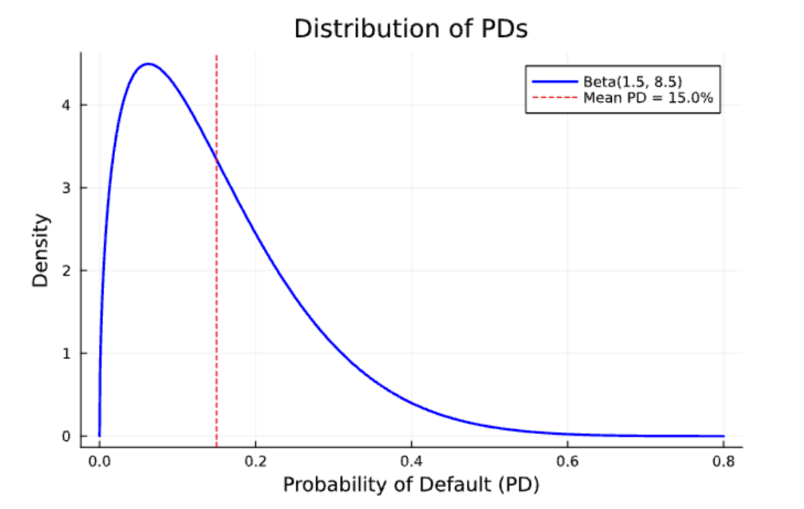
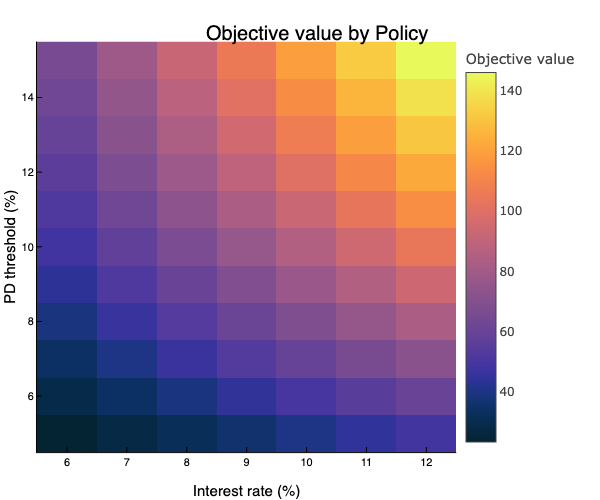
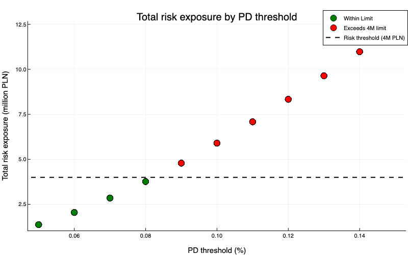
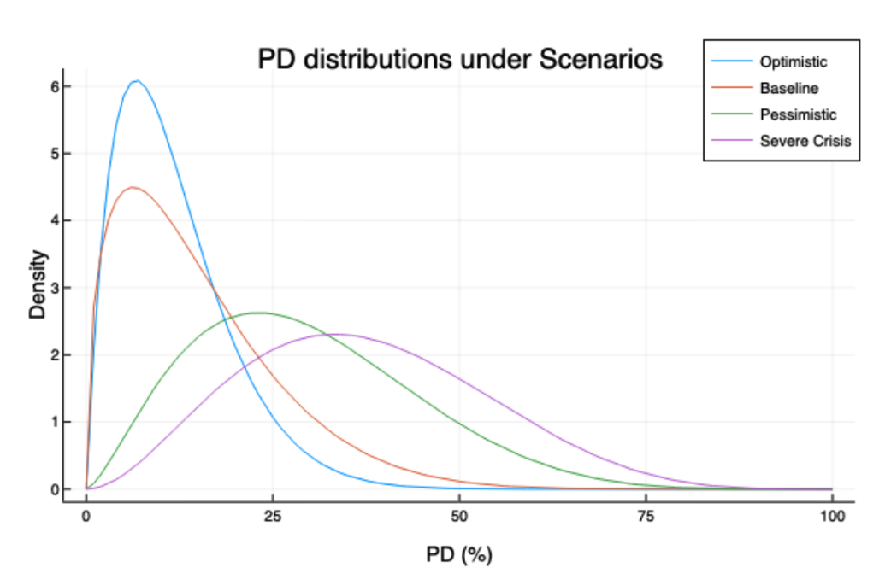
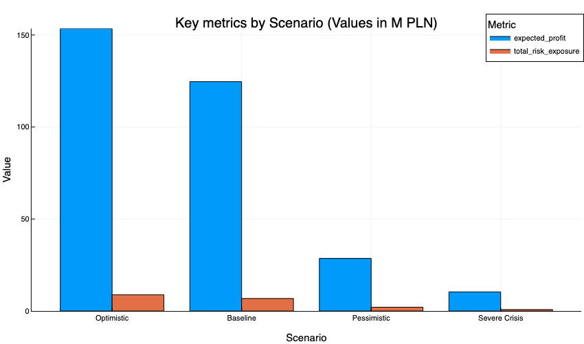
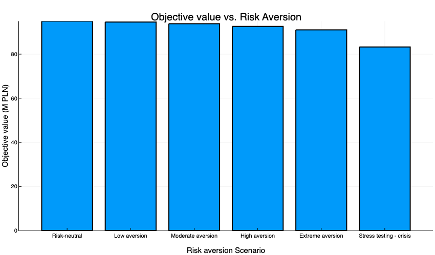

# NovaRate loan approval strategy simulation — Optimizing credit policy for NovaBank S.A.

## Project Overview

In a rapidly evolving Polish banking landscape, NovaBank S.A. aims to optimize its credit policy for the NovaRate loan product. Using Monte Carlo simulation and risk-constrained optimization, this project identifies the optimal combination of interest rate and PD (probability of default) threshold that maximizes expected profit while maintaining capital discipline and customer coverage targets.

---

## Business context

**NovaBank S.A.** - a fictional bank, is a digital-focused commercial bank headquartered in Warsaw, Poland. In response to competition from major banks and fintechs, NovaBank introduced **NovaRate**, a 5-year fixed installment loan of **50,000 PLN** designed for financially stable individuals. Collateral (≥45% of the loan) is required to mitigate default risk.

The bank aims to achieve:
- Growth in lending revenue
- Controlled risk exposure
- Strong customer acquisition and competitiveness

---

## Optimization objective

The goal is to determine the optimal:
- **Interest rate (r)** within [6%, 12%]
- **PD threshold (t)** within [0%, 15%]

Constraints:
- Minimum **expected profit**: 2 million PLN
- Maximum **total risk exposure**: 4 million PLN
- Minimum **acceptance rate**: 30%

The **objective function** maximizes:

**Expected Profit – λ × Total Risk Exposure**

Where:
- Profit = Interest Income – Expected Loss – Operating Cost
- Constant values:
  - Loan amount = 50,000 PLN
  - LGD = 55%
  - Operating cost = 400 PLN/loan
  - Loan term = 5 years
  - λ = 0.3
- Expected Loss = PD × LGD × Loan Amount
- Simulated 10000 potential loan applicants using Beta distribution for PD (α = 1.5, β = 8.5)

This assumption is based on empirical observations of similar unsecured consumer lending products in the Polish market, where the majority of approved applicants exhibit low default probabilities, but a non-negligible tail of higher-risk applicants still exists.

---

## Key results

| Metric                | Value                |
|-----------------------|----------------------|
| **Optimal Interest Rate** | 12%               |
| **Optimal PD Cutoff**     | 8%                |
| **Expected Profit**       | ~83 million PLN   |
| **Risk Exposure**         | ~3.76 million PLN |
| **Acceptance Rate**       | ~30%              |
| **Objective Value**       | ~82.14 million PLN|

This policy aligns with the CFO’s goal of capital efficiency and the COO’s goal of customer acquisition.

- The most profitable policy (r = 12%, t = 14%) is **rejected** due to breaching risk exposure cap (≈11M PLN risk).

  
- The selected policy (r = 12%, t = 8%) offers a **near-optimal profit** with **acceptable risk**, just below the 4M PLN cap.
- The trade-off frontier shows the risk "hockey stick" effect beyond 8% PD threshold.

---
## Sensitivity analyses

**Objective:** examine the stability of the optimal solution when one specific input variable is altered—such as the distribution of the probability of default (PD), loss given default (LGD) rate, or the risk aversion of the bank—while keeping all other variables constant. T 

| Parameter                | Impact on optimal policy (r, t)                                                                 |
|-------------------------|-----------------------------------------------------------------------------------------------|
| Risk Aversion (λ)       | Higher risk aversion leads to stricter thresholds and potentially lower interest rates to retain low-risk customers → t may be increased, r may be decreased or unchanged |
| Loss Given Default (LGD)| Higher LGD leads to higher compensation via increased rates and tighter approval policies → t may be increased, r may be increased |
| PD distribution (βₐ, β_b)| Riskier population means tighter approval and higher interest to mitigate default exposure → t may be increased, r may be increased |
| Loan amount (A)         | Larger loans increase returns and may allow more flexibility in approval → t may be decreased or unchanged, r may be increased |
| Operation cost (c_op)   | Higher operating cost necessitates higher return per loan → t may be increased, r may be increased |

*Simulation model’s parameters affecting the Optimal Policy*

### Shift of PD distribution

Four general scenarios are tested with their expected PD means: 
- Optimistic: 7%
- Baseline: 15%
- Pessimisitic: 29%
- Severe crisis: 38%

**Optimal policies under different market scenarios (without constraints)**

| Scenario       | Opt. Interest Rate | Opt. PD Threshold | Exp. Profit (M PLN) | Exp. Acceptance Rate | Exp. Total Risk Exposure (M PLN) | Exp. Objective Value |
|----------------|--------------------|--------------------|----------------------|------------------------|----------------------------------|------------------------|
| **Optimistic** | 0.12               | 0.07               | 84,099               | 0.30                   | 3,615                            | 88,014                 |
| **Baseline**   | 0.12               | 0.08               | 83,276               | 0.30                   | 3,765                            | 82,146                 |
| **Pessimistic**| 0.12               | 0.12               | 28,136               | 0.11                   | 2,549                            | 27,372                 |
| **Severe Crisis** | 0.12            | 0.12               | 10,228               | 0.04                   | 1,001                            | 9,928                  |

- **Profitability declines significantly** under stress scenarios (Pessimistic and Severe Crisis), even with optimal policies.
- Under **Severe Crisis**, expected profit is only ~10M PLN with an **acceptance rate of just 4%**, highlighting challenges in sustaining lending during economic downturns.
- Unconstrained optimization tends to **maximize profit** at the expense of **risk exposure and customer access**, especially problematic in adverse scenarios.

  
> During downturns, **PD distributions shift upward**, increasing rejection rates. The model responds by **tightening PD thresholds** to avoid breaching risk limits, reducing eligible customers. This leads to a conservative lending policy that protects against losses but also **limits growth and credit supply**.

The results demonstrate that under extreme market stress, unconstrained profit-maximizing strategies are **insufficient** to balance growth, risk, and acceptability. This highlights the **need for adaptive lending policies**, potentially involving **dynamic risk tolerance** or **enhanced capital buffers** during crises.

---

### Bank's risk aversion

The risk aversion of the bank is also tested to see how does it affect the objective value

**Lambda scenarios tested**

| Scenario                     | Lambda (λ) | Interpretation                                 |
|-----------------------------|------------|------------------------------------------------|
| Risk-neutral                | 0.0        | Purely profit-focused; no concern for risk     |
| Low aversion                | 0.1        | Slight concern about risk                      |
| Moderate aversion           | 0.3        | Balanced between profit and risk               |
| High aversion               | 0.6        | Stronger emphasis on risk control              |
| Extreme aversion            | 1.0        | Prioritizes safety; tolerates lower returns    |
| Stress testing – Crisis     | 3.0        | Emergency mode; extremely low risk tolerance   |

This range helps us assess whether small changes in λ cause **gradual or sharp shifts** in optimal policy and whether the current strategy is **robust** under different internal and external pressures.

**Key findings**

Across all tested λ values:

- **Optimal policy remains stable**:
  - **Interest rate**: 12%
  - **PD threshold**: 8%
- **Performance metrics remain unchanged**:
  - **Expected profit**: ~94.95 million PLN
  - **Acceptance rate**: 35.17%
  - **Total risk exposure**: ~3.92 million PLN

This suggests that the chosen policy is located at a **robust equilibrium point**, where moderate changes in risk tolerance do not necessitate a policy adjustment.

While policy parameters and outcomes remain constant, the **objective value decreases** as λ increases, due to increased penalization of risk exposure:

| Lambda (λ) | Objective Value (M PLN) |
|------------|-------------------------|
| 0.0        | 83.27                   |
| 0.3        | 82.14                   |
| 1.0        | 79.51                   |
| 3.0        | 71.97                   |

- At **λ = 0**, the full expected profit is realized.
- At **λ = 3.0**, the heavily penalized risk exposure reduces the objective value by over 11 million PLN.

Although the **structure of the optimal policy remains unchanged**, its **perceived value** varies depending on the bank’s risk tolerance. This implies:

- For **moderate shifts** in λ, the strategy remains valid.
- For **highly risk-averse conditions** (e.g. crisis stress tests), the **declining objective value** signals **increased discomfort** with current risk exposure—even if it meets internal caps.
- The findings support the **resilience** of the recommended policy while acknowledging the need for possible reassessment under **extreme conditions**.

---
## Conclusion and Recommendations

### Conclusion

This project developed and evaluated an **optimal loan approval policy** using a Monte Carlo simulation framework, targeting a balance between **expected profit** and **risk exposure**. The key findings can be summarized as follows:

- **Optimal Strategy (Unconstrained)**:
  - **Interest rate**: 12%
  - **PD threshold**: 8%
  - **Expected profit**: ~94.95 million PLN
  - **Acceptance rate**: ~35.17%
  - **Expected total risk exposure**: ~3.92 million PLN
  - This strategy yielded the highest profitability while remaining below the internal risk cap.

- **Sensitivity analysis** revealed that under **stress conditions** (e.g., pessimistic or crisis scenarios), both profitability and acceptance rate **dropped significantly**:
  - In the **Severe Crisis** case, profit dropped to ~10 million PLN, and acceptance rate fell to just 4%.
  - Although optimal policies still adopted high interest rates and tightened PD thresholds, the economic environment limited profitability and lending capacity.
  - These results illustrate that **unconstrained optimization** might not be suitable in real-world crisis situations, where regulatory and reputational concerns come into play.

- **Sensitivity analysis on Risk Aversion (λ)**:
  - Even as the bank’s risk aversion increased (λ from 0 to 3), the **optimal policy parameters remained unchanged** (12% interest, 8% PD cutoff).
  - However, the **objective value declined** with higher λ, reflecting discomfort with the same risk level under more conservative preferences.
  - This suggests that the proposed strategy is **robust** and **resilient** to moderate shifts in internal risk preferences.

### Recommendations

1. **Adopt the identified optimal policy** (12% interest rate, 8% PD threshold) under normal or moderately adverse conditions, as it offers a high expected return while maintaining risk exposure within acceptable limits.

2. **Incorporate constrained optimization** for stress scenarios:
   - During downturns, unconstrained profit-maximizing strategies may result in low acceptance rates and high exclusion of borrowers.
   - Risk-adjusted or constraint-based optimization should be employed to ensure lending continuity and regulatory compliance.

3. **Regularly monitor macroeconomic indicators** to recalibrate the PD distribution and adjust the policy dynamically. Economic deterioration leads to a significant reduction in profitable opportunities, requiring tighter approval policies or reconsideration of capital buffers.

4. **Use risk aversion sensitivity testing** as a strategic tool:
   - Evaluate how policy robustness holds under shifts in internal priorities (e.g., from growth to stability).
   - Align decision-making with the bank’s current strategic mindset and capital planning.

5. **Reassess lending strategy under crisis-mode conditions**, where even robust policies yield diminishing returns. Consider alternative approaches such as:
   - Portfolio diversification
   - Credit guarantees or insurance
   - Temporary interest subsidies

By combining profit optimization with stress-tested, risk-aware decision-making, the bank can develop a **sustainable and adaptable lending strategy** that is well-prepared for both growth and crisis periods.

### Key takeaways for data science work:

- **Robustness**: The optimal policy is stable across moderate shifts in economic scenarios, PD distributions, and internal preferences (λ). This confirms the robustness of the model for real-world application.
- **Scalability**: The simulation framework is modular and scalable; it can be reused for product-specific tuning, geographic expansion, or changing economic conditions by simply reconfiguring constraints or input distributions.
- **Risk-aware optimization**: Embedding λ directly into the objective function is an elegant way to align business risk appetite with profit maximization, without the need to manually tune constraints.
- **Practical constraints matter**: Comparing constrained and unconstrained strategies revealed the importance of incorporating business requirements early in model design. Data scientists should prioritize feasibility and compliance alongside raw performance.
- **Future improvements**:
  - Introduce **stochastic interest rate modeling** to account for macroeconomic volatility.
  - Add **customer behavior modeling** (e.g., churn or prepayment risk) for more realistic expected profit.
  - Incorporate **multi-product portfolio optimization** to simulate cross-selling effects or capital allocation trade-offs.

This project demonstrates how **applied data science and simulation modeling** can empower banks to make transparent, explainable, and profit-maximizing decisions—while remaining within defined risk limits. As such, this framework is well-positioned to support ongoing policy refinement, stress testing, and long-term strategic planning for NovaBank and similar financial institutions.

